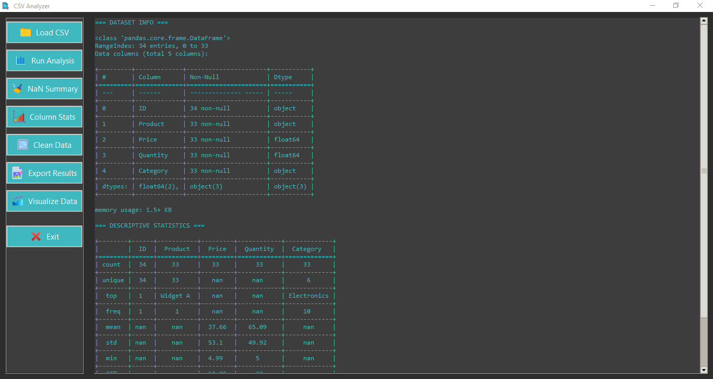
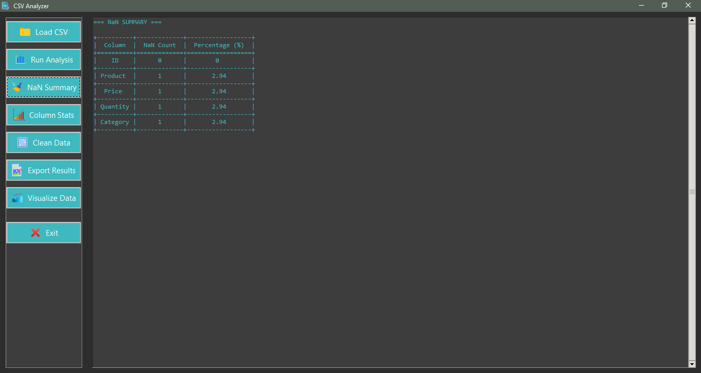
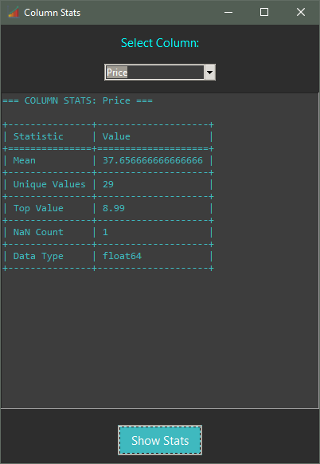
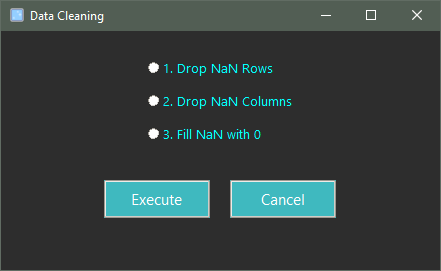
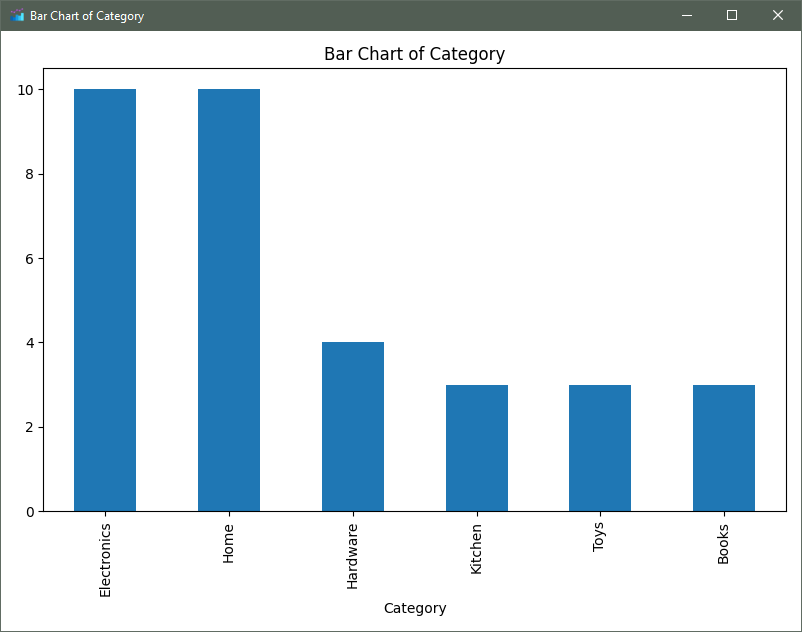

# 🧠 CSV Analyzer - Desktop App (Python + Tkinter)

**CSV Analyzer** is a lightweight and intuitive desktop application designed to simplify the process of analyzing, visualizing, and cleaning CSV files, all in a GUI environment.

This public repository showcases the assets and user interface of the app for demo and portfolio purposes.

---

## ✨ Features

- **Load and preview** any CSV file via a graphical interface
- **Instantly view key metadata:** number of rows/columns, column names, and data types
- **Get descriptive statistics** (mean, min, max, std, etc.) for each column
- **Count and display** missing (NaN) values across the dataset
- **Column wise stats:** For any selected column, view data type, non-null count, unique value count, most frequent (mode) value, min/max value (for numeric columns)
- **Data cleaning tool:** Instantly fill all NaN values with 0, drop rows/columns with any NaN values
- **Data visualization:** View bar plot for categories, pie chart of distributions, histogram for numeric columns
- **Export results:** Save analysis report of current window to a txt or csv file
- **Fully local —** no data is sent or stored externally

---

## 🔧 Tech Stack

- `Python 3`
- `Tkinter` (GUI)
- `pandas` (Data analysis)
- `matplotlib` (Data visualization)
- `tabulate` (Formatted output for export)

---

## 📸 Screenshots

|              App UI               |            Data Analysis            |          NaN Summary           |
|:---------------------------------:|:-----------------------------------:|:------------------------------:|
|  |  |  |

|          Column Statistics           |          Data Cleaning           |           Data Visualizer            |
|:------------------------------------:|:--------------------------------:|:------------------------------------:|
|  |  |  |

|              Bar Chart               |
|:------------------------------------:|
|  |
---

## 🎥 Demo Walkthrough
You can find the full app walkthrough video in the `assets` folder:  
📁 `assets/demo_walkthrough.mp4`  
*Note: The video will download when clicked since GitHub does not stream `.mp4` files directly.*

---
## 🧪 Want to Try It?

A `.exe` version is available on request.  
[Feel free to reach out via email](mailto:ayaanbinnadeem1205@gmail.com) for demo access or custom builds.

---

## 🚀 Need Something Similar?

Want a personalized AI bot or custom desktop Python app?  
Get in touch to discuss your requirements.

---

## 📝 Note

This is a **demo showcase only** — source code is not included in this repository.  
For code access or collaboration, feel free to contact me directly.

---
## 🙋‍♂️ Author

**Ayaan Nadeem**  
Python Developer | Desktop Apps, Automation & AI/ML Tools  
 📫 [Email](mailto:ayaanbinnadeem1205@gmail.com)

---
##  🛡️ License
**Demo Only** — All rights reserved.

